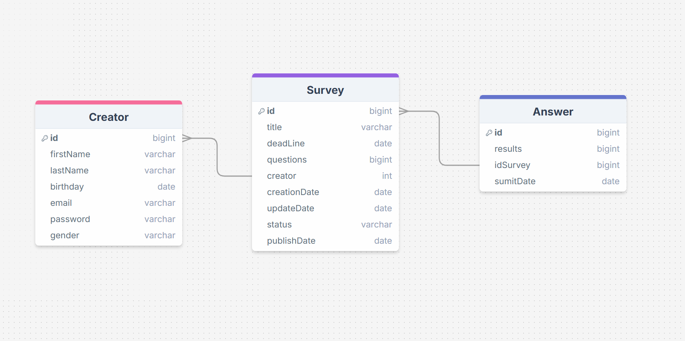

# App de encuestas

# Roles:

    Creador de encuestas
        Crear encuestas
        Publicar encuestas
        Editar encuestas
        Elimnar encuestas
        Ver resultados de encuestas (gráficas)
        Editar datos de perfil
        Eliminar cuenta
    Público en general
        Registrar una cuenta de creador
        Iniciar sesión
        Responder encuesta
        Ver resultados de encuestas (censurado)

# Casos

0. Registro de creador:
   Las personas se pueden registrar como creadoras de encuestas ingresando los siguientes datos:

- Nombres
- Apellidos
- Fecha de nacimiento
- Correo electrónico
- Contraseña
- Género

1. Verificación de correo:
   Los creadores recién registrados les será enviado un correo con un enlace a el sitio para validar su correo electrónico, este enlace caduca y de no ingresar a tiempo un mensaje se le mostrará en pantalla y si el enlace aún es válido se iniciará sesión de manera automática

2. Inicio sesión creador:
   Solo los creadores registrados y verificados podrán iniciar sesión en la plataforma para poder crear encuestas y ver los resultados completos.
   Para iniciar sesión el creador deberá ingresar el correo y contraseña de su cuenta, si los datos no coinciden se mostrará una notificación de ello, de lo contrario, se redirigirá a la pantalla principal de creadores

3. Editar información general de perfil de creador:
   Los creadores pueden modificar su propia infromación como nombres, apellidos, fecha de nacimiento, género en cualquier momento

4. Cambio de credenciales:
   Los creadores pueden modificar sus credenciales necesarias para inicio de sesión pero antes se necesitará validar la autenticación del usuario (se necesita confirmar la nueva contraseña e ingresar la anterior contraseña), de ser efectuado algún cambio en las credenciales, se hará llegar un correo para notificar el cambio, si se cambia el correo deberá llegar la notificación al correo anterior

5. Creación de encuestas:
   Los creadores que hayan iniciado sesión pueden crear encuestas, los datos para crear una nueva son:

   - Título de encuesta
   - Fecha límite para contestar encuesta
   - Preguntas de la encuesta pueden ser abiertas o de opción múltiple, de ser opción múltiple el creador de encuesta debe especificar las posibles opciones

6. Edición de encuestas:
   Las encuestas que no se hayan publicado aún podrán ser editadas se les puede cambiar todos los datos, solo se pueden modificar las encuestas que uno mismo haya creado.

7. Eliminación de encuestas
   Al igual que la edición esta acción solo se podrá efectuar en las encuestas propias que no se hayan publicado

8. Publicar encuesta
   El creador de encuestas puede publicar alguna encuesta suya que no se haya publicado antes, al hacer esta acción en pantalla se mostrará un diálogo con opciones para compartir la encuesta tales como:

   - Crear QR
   - Copiar enlace de encuesta

9. Visualizar mis encuestas:
   El creador de encuestas podrá ver enlistadas las encuestas creadas además podrá buscar, filtrar y ordenar por:

   - Título
   - Rango de fechas de creación y/o finalización

   Además por cada encuesta podrá acceder a la pantalla de edición, eliminado y si la encuesta ya fue publicada podrá terminar su publicación (finalizar encuesta)

10. Visualizar estadísticas
    El creador de encuestas podrá seleccionar una encuesta de la lista y con ello verá los detalles y resultados de la misma
    Una tabla de todos los resultados de esa encuesta y también las gráficas de las preguntas que pueden ser usadas para ello.

11. Responder encuesta
    Las personas que tengan acceso al QR o link generado de una encuesta ya publicada, podrán responderla sin necesidad de tener alguna cuenta en la página
    Al terminar de responder la encuesta podrá dar clic en el botón de enviar el cual mostrará un mensaje de agradecimiento y esa persona no debería poder responder la misma encuesta
